# Monit

> 用于展示各种信息的桌面小组件。[官网](https://monit.fzf404.art/#/)

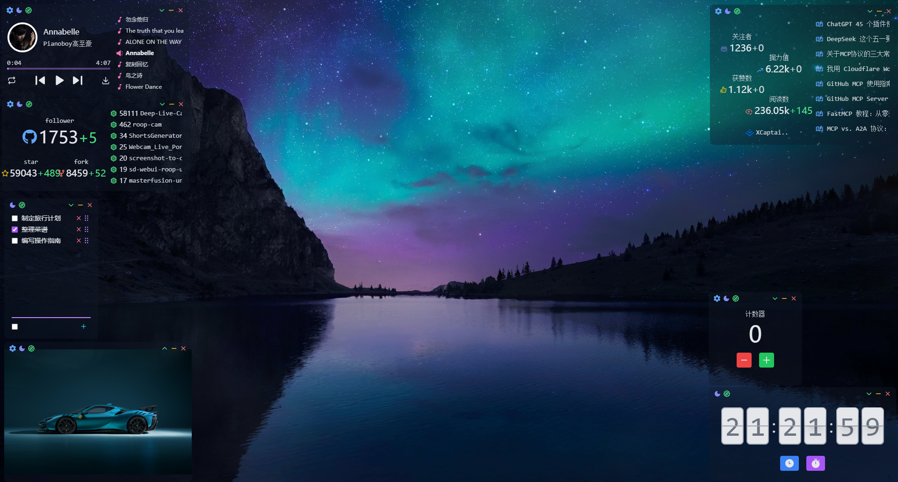

## 初见

---

Monit 软件很美观，操作简单。挂在桌面的小组件，可以：

- 听自己的网易云歌单
- 查看GitHub数据
- 处理 ToDo 事项
- 按秒展示时间
- 展示喜欢的图片
- ...

​    

## 速通

---

### 📦安装方法

> 推荐小白用户使用方法1

方法1：双击exe直接安装

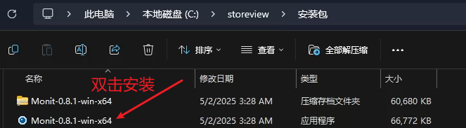

方法2：解压缩（去到安装目录，点击exe程序）

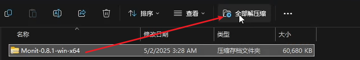

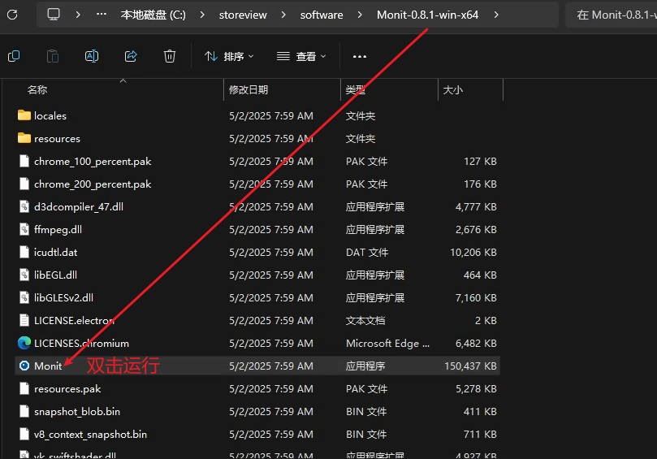

### 🔧基础操作

#### 1、贴网络或本地图片

1、贴图片网址则展示图片

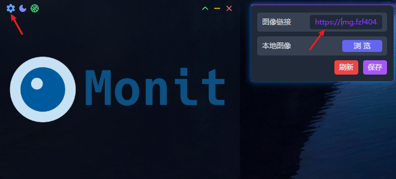

2、或打开本地图像


#### 2、听网易云歌单

支持扫码登录，获取歌单

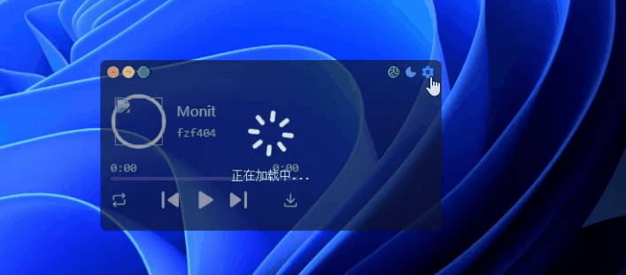

#### 3、读秒显示时间

对于一些需要在桌面上看到**分秒**的用户来说，非常实用

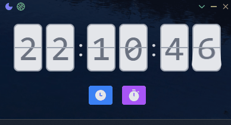

#### 4、跟踪Github和掘金账户数据

输入Github用户名，或者掘金主页URL末尾那串id，就可以**不登陆情况下**跟踪**获取数据**

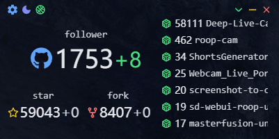

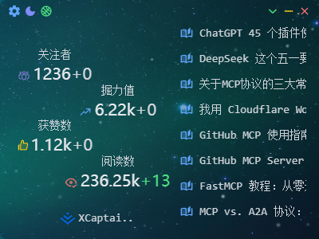

#### 5、计数器

支持设置**初始值**和每次**点击增加**多少

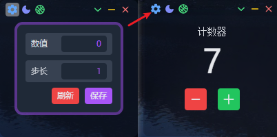

#### 6、摄像头功能

可自行体验摄像头等其他功能

### ⚗️病毒检测

360杀毒的病毒检测✅

​    

## 大师

---

#### 🗃️配置文件

##### 1、配置地址

输入快捷键`Win+R`打开这个目录，并复制 config 文件

```
%AppData%/monit
```

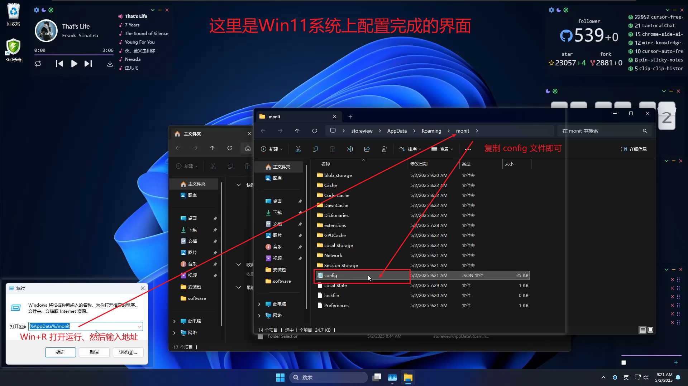

##### 2、复制配置

将配置**复制**到另一个系统上，**界面布局完全一致**

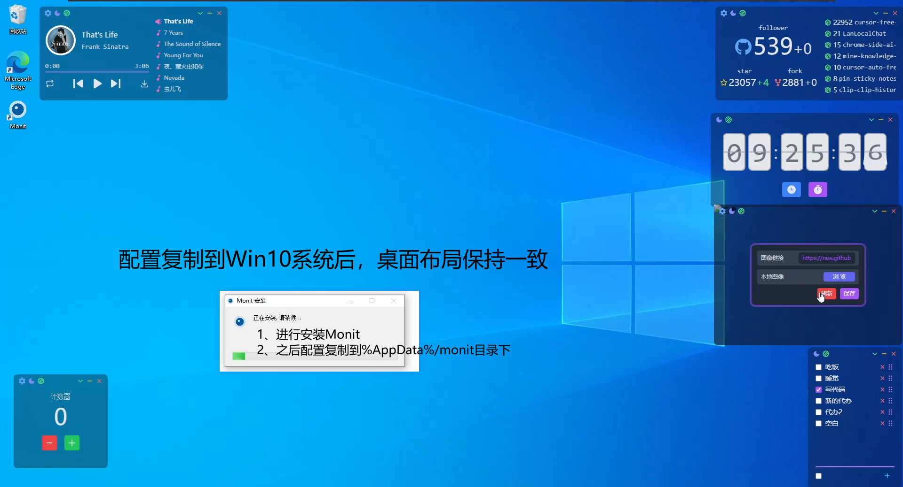

#### ⚙️高级功能

暂无

功能齐全，用户体验良好，操作简单 ✨

#### 🎨自定义（写代码）

软件作者提供了详尽的[开发插件的方法](https://monit.fzf404.art/#/zh/02-summary)，具有前端基础的用户可以自行开发小组件，满足自己的需要

> 有相关开发经验的朋友可以补充分享内容到这（提交PR）

#### 🧑‍💻更多软件

该**软件作者**还开发了像素画工具等等：[作者主页：fzf404 (fzf404)](https://github.com/fzf404)

